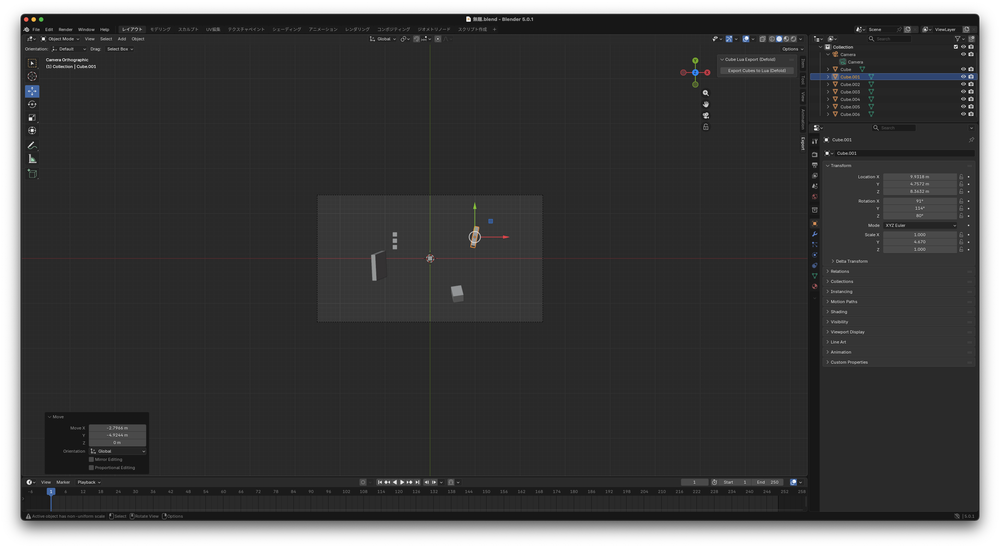
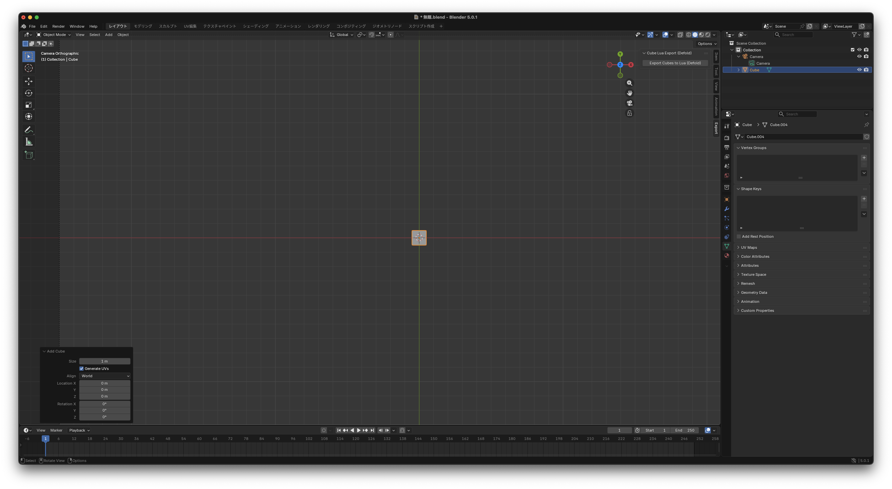
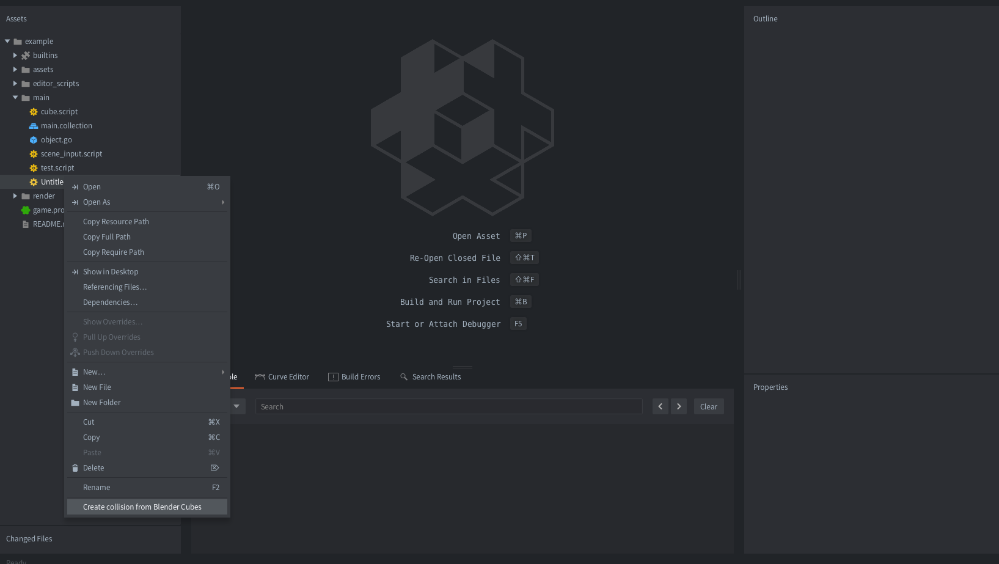
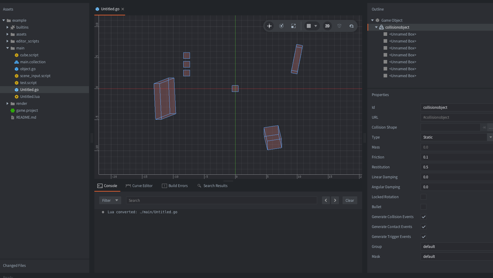

# Blender Cube → Lua Table Exporter
This Blender add-on exports placed Cube objects into a Lua table.
## ⚠️ Important:
This add-on does NOT create game engine instances or scene objects.
It only outputs structured Lua data describing the cubes.
The responsibility for instantiating objects lies entirely on the GameEngine side.

## Features
This add-on **only exports data**.
It converts Blender Cube objects into a **Lua table** describing:
- name
- position
- rotation (degrees)
- scale
Beginner-friendly, minimal setup

## Example Output
```lua
return {
    {
        name = "Cube_01",
        position = { x = 0, y = 0, z = 0 },
        rotation = { x = 0, y = 45, z = 0 },
        scale    = { x = 1, y = 1, z = 1 },
    },
    {
        name = "Cube_02",
        position = { x = 2, y = 0, z = 1 },
        rotation = { x = 0, y = 0, z = 0 },
        scale    = { x = 0.5, y = 2, z = 1 },
    },
}
```

## Supported Objects
Mesh Object
Type: Cube
Other mesh types are ignored by design.

## Installation
1. Download or clone this repository
2. Open Blender
3. Go to **Edit → Preferences → Add-ons**
4. Click Install…
5. Select the .py file from this repository
6. Enable the add-on

## Usage
1. Open or create a Blender scene
2. Add Cubes (Shift + A → Mesh → Cube)
3. Position / rotate / scale the Cubes as desired
4. Run the exporter from: * `File → Export → Cube to Lua Table`
5. Choose a destination .lua file


> [!TIP]
> **Size Note:** Blender's default cube is **2.0 units**. Set it to **1.0 unit** to match the visual scale of most game engines.


## Coordinate System Notes
Blender and Defold use different axis conventions. This add-on exports raw Blender coordinates **without automatic axis conversion**.

| System | Up Axis | Note |
| :--- | :--- | :--- |
| **Blender** | **Z-up** | Height is stored in the `z` field |
| **Defold** | **Y-up** | Height is expected in the `y` field |

> [!IMPORTANT]
> Because this add-on does not swap axes during export, a Cube's height in Blender (Z) will be written to the `z` key in the Lua table. When importing into Defold, you must handle this coordinate mapping (e.g., mapping Blender `z` to Defold `y`) within your Editor Script or runtime logic.

## Defold Example (Optional)
As a small **optional example**, a simple Defold project and Editor Script are included.
They are provided only as a **reference implementation**, to show one possible way to:

- Load the exported Lua table
- Create GameObjects from the data
- Write `.go` files or spawn instances




These examples are **not required** to use this add-on.

You are free to:
- Implement your own importer
- Use a different engine
- Ignore the Defold examples entirely

## Tested Environment
Blender 5.0.1
Defold 1.11.2

## License
MIT License
Feel free to use, modify, and distribute.
